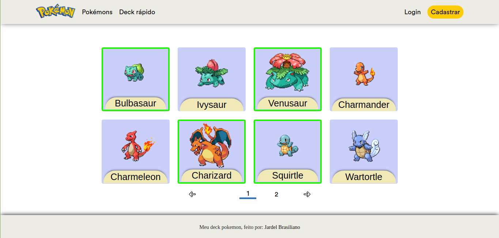
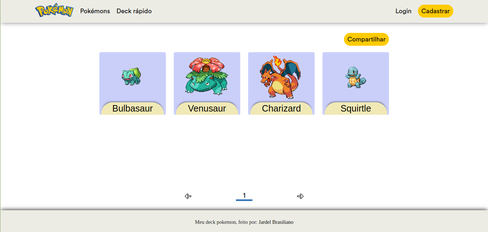

## Projeto

Crie seu deck pokemon e compartilhe.

## Imagens

- Tela 01
  

- Tela 02
  

## Tecnologias

Esse projeto foi desenvolvido utilizando as seguintes tecnologias:

- [React](https://reactjs.org/)
- [Firebase](https://firebase.google.com/?hl=pt-br)
- [redux](https://redux.js.org/)
- [redux-saga](https://redux-saga.js.org/)
- [axios](https://github.com/axios/axios)
- [immer](https://github.com/immerjs/immer)
